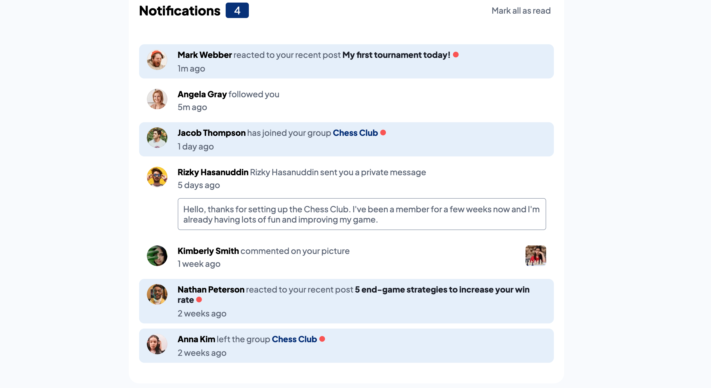

# Notifications page with JavaScript

[Notifications page challenge on Frontend Mentor](https://www.frontendmentor.io/challenges/notifications-page-DqK5QAmKbC)를 기반으로 제작한 프로젝트입니다.

## 목차

- [Overview](#overview)
  - [The challenge](#the-challenge)
  - [Screenshot](#screenshot)
  - [Links](#links)
- [My process](#my-process)
  - [Built with](#built-with)
  - [What I learned](#what-i-learned)
  - [Continued development](#continued-development)
  - [Useful resources](#useful-resources)
- [Author](#author)

**Note: Delete this note and update the table of contents based on what sections you keep.**

## Overview


### The challenge

Users should be able to:
- 읽지않은 상태와 읽은 상태를 시각적으로 구분
- "Mark all as read"를 누르면 읽지 않은 메세지들을 전부 읽게 처리
- 디바이스 크기에 맞추어 반응형 웹 사이트 구현
- hover와 focus를 통해 현재 확인하고 있는 요소를 강조

### Screenshot



### Links

- Solution URL: [Repistory](https://github.com/MinnieMinwoo/JS_Practice_Notifications_Page)
- Live Site URL: [Web Page](https://minnieminwoo.github.io/JS_Practice_Notifications_Page/)

## My process

### Built with

- Semantic HTML5 markup
- CSS with Flex
- Vanilla JS

### What I learned

구현 요건만을 가지고 프로젝트를 완성했다는것이 가장 큰 의의라 생각한다.  
코드에서는 CSS에서 자식 선택자를 선택하는 방법에 대해 알게 되었다.
```css
#body > li.read > span:nth-child(2) > span.readDot {
    display: none;
}
```
또한 js에서 for문간의 차이를 이해하고, querySelectorAll을 통해 반환받은 결과를 반복하기 위해서 for..of문을 사용하는 것이 가장 적합함을 알 수 있었다. 
```js
function allRead() {
    const listSet = document.querySelectorAll('li');
    for(let list of listSet){
        addReadClass.call(list);
    }
    checkNum ();
}
```

### Continued development
다음 주제를 추가로 학습하고자 한다.
- CSS 요소를 유지보수하기 좋게 배치하는 방법
- React 라이브러리를 통한 사이트 구성 방법

### Useful resources
- [MDN](https://developer.mozilla.org/ko/) - 모르는 것이 있을때 MDN 문서를 찾아보면 대부분 답이 나온다

## Author
- Frontend Mentor - [@MinnieMInwoo](https://www.frontendmentor.io/profile/MinnieMinwoo)
